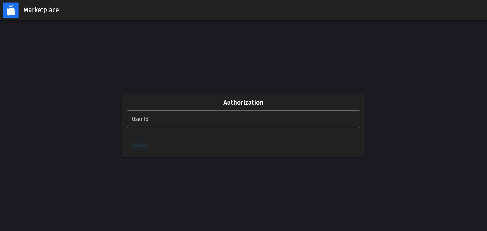

# Marketplace

<p align="center">
    

    A modern marketplace for modern ladies

</p>


## Screenshots



## Usage

```sh
yarn install
```

### Compile and Hot-Reload for Development

```sh
yarn run dev
```

### Type-Check, Compile and Minify for Production

```sh
yarn run build
```

### Run Unit Tests

```sh
yarn run test:unit
```

### Lint

```sh
yarn run lint
```
